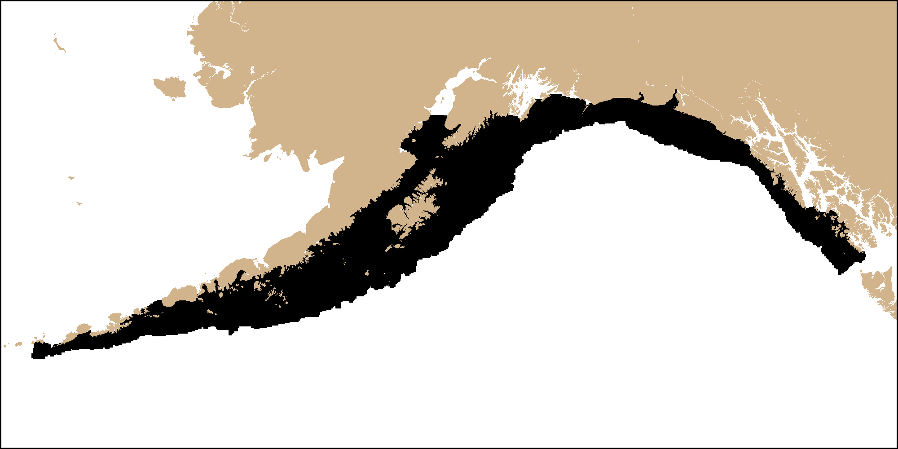
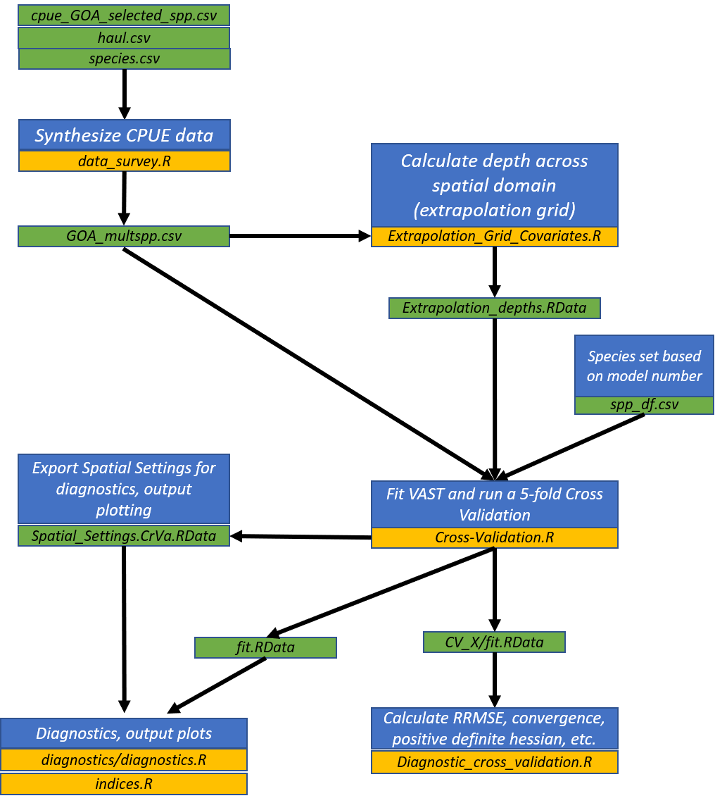

# Multispecies Operating Model of the Gulf of Alaska

## Overview

This repository houses the code used to provide a multispecies spatiotemporal
operating model for the Gulf of Alaska groundfish species complex. A vector
autoregressive spatiotemporal model (VAST; 
https://github.com/James-Thorson-NOAA/VAST) was used to fit single-species 
spatiotemporal models. The Gulf of Alaska groundfish bottom trawl survey was
the main data source. Two types of models were evaluated for each species, 
a model with no density covariates and a model with depth modeled as a 
quadratic effect. Ten-fold cross-validation was used to calculate the mean 
out-of-fold root-mean square error (RMSE) and the model with lower RMSE was
chosen. Finally, biomass density from each selected candidate model were
predicted for each species onto the spatiotemporal domain and density 
predictions from each species was knitted together to produce a 3D array of
density predictions of dimensions: number of species, number of grid cells,
number of years. 

Output from this repository will feed directly to another repository, 
https://github.com/zoyafuso-NOAA/Optimal_Allocation_GoA.

## Species Included

The species set included in the are a complex of Gulf of Alaska cods, 
flatfishes, and rockfishes:

| Scientific Name                     | Common Name                           |
|-------------------------------------|---------------------------------------|
| *Atheresthes stomias*               | arrowtooth flounder                   |
| *Gadus chalcogrammus*               | Alaska or walleye pollock             |
| *Gadus macrocephalus*               | Pacific cod                           |
| *Glyptocephalus zachirus*           | rex sole                              |
| *Hippoglossoides elassodon*         | flathead sole                         |
| *Hippoglossus stenolepis*           | Pacific halibut                       |
| *Lepidopsetta bilineata*            | southern rock sole                    |
| *Lepidopsetta polyxystra*           | northern rock sole                    |
| *Microstomus pacificus*             | Pacific Dover sole                    |
| *Sebastes alutus*                   | Pacific ocean perch                   |
| *Sebastes melanostictus/aleutianus* | blackspotted and rougheye rockfishes* |
| *Sebastes brevispinis*              | silvergray rockfish**                 |
| *Sebastes polyspinis*               | northern rockfish                     |
| *Sebastes variabilis*               | dusky rockfish                        |
| *Sebastolobus alascanus*            | shortspine thornyhead                 |

*Due to identification issues between two rockfishes these two species were 
combined into a species group we will refer as "Sebastes B_R" (blackspotted 
rockfish and rougheye rockfish, respectively) hereafter. 

## Input Data -- Spatial Domain

The spatial domain of the survey optimization is the Gulf of Alaska 
divided into a rougly 5-km resolution grid resulting in N = 22832 total survey cells.
The script used to create the survey grid is contained in the MS_OM_GoA repo 
(https://github.com/zoyafuso-NOAA/MS_OM_GoA) in the using the script 
Extrapolation_Grid_Covariates.R in the data/ directory. That script produces 
an RData producted called Extrapolation_depths.RData that is contained within 
the data/ directory this repo. Extrapolation_depths.RData contains a variable 
called Extrapolation_depths which is a dataframe of N rows. Useful fields for 
this analysis are stated in the table below:

