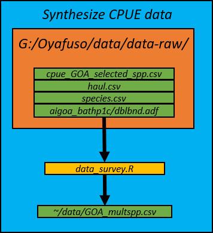
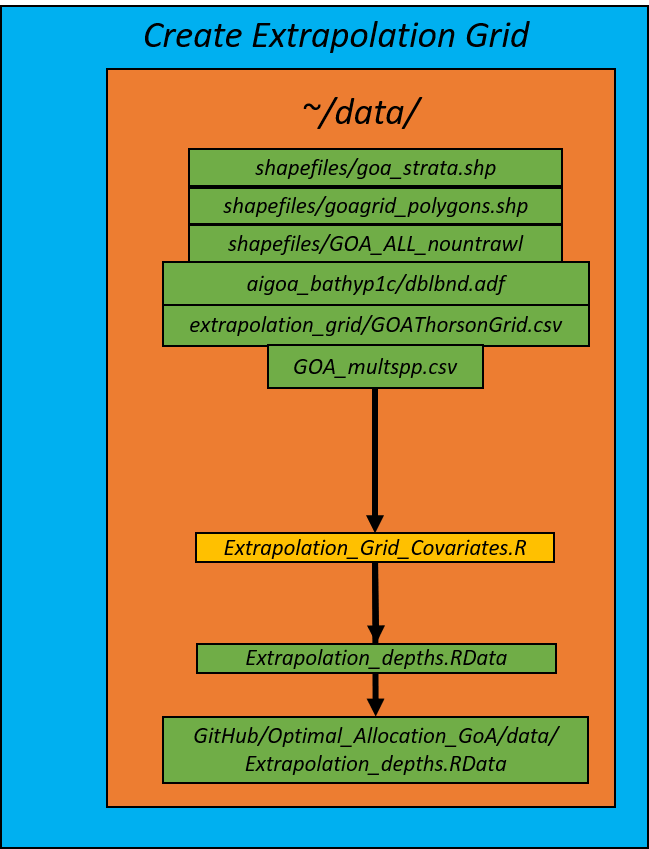

# Multispecies Operating Model of the Gulf of Alaska

## Overview

This repository houses the code used to provide a multispecies spatiotemporal
operating model for the Gulf of Alaska groundfish species complex. A vector
autoregressive spatiotemporal model (VAST; 
https://github.com/James-Thorson-NOAA/VAST) was used to fit single-species 
spatiotemporal models. Catch and effort data from the Gulf of Alaska 
groundfish bottom trawl survey was used using data from 1996-2019.
Two types of models were evaluated for each species, a model with no density
covariates and a model with depth modeled as a quadratic effect. Ten-fold 
cross-validation was used to calculate the mean out-of-fold root-mean square 
error (RMSE) and the model with lower RMSE was chosen. Finally, biomass 
density from each selected candidate model were predicted for each species 
onto the spatiotemporal domain and density predictions from each species was
knitted together to produce a 3D array of density predictions of dimensions:
number of species, number of grid cells, number of years. 

Output from this repository will feed directly to another repository, 
https://github.com/zoyafuso-NOAA/Optimal_Allocation_GoA.

## Species Included

The species set included in the are a complex of Gulf of Alaska cods, 
flatfishes, and rockfishes for a total of ns = 15 species:

| Scientific Name                     | Common Name                           |
|-------------------------------------|---------------------------------------|
| *Atheresthes stomias*               | arrowtooth flounder                   |
| *Gadus chalcogrammus*               | Alaska or walleye pollock             |
| *Gadus macrocephalus*               | Pacific cod                           |
| *Glyptocephalus zachirus*           | rex sole                              |
| *Hippoglossoides elassodon*         | flathead sole                         |
| *Hippoglossus stenolepis*           | Pacific halibut                       |
| *Lepidopsetta bilineata*            | southern rock sole                    |
| *Lepidopsetta polyxystra*           | northern rock sole                    |
| *Microstomus pacificus*             | Pacific Dover sole                    |
| *Sebastes alutus*                   | Pacific ocean perch                   |
| *Sebastes melanostictus/aleutianus* | blackspotted and rougheye rockfishes* |
| *Sebastes brevispinis*              | silvergray rockfish**                 |
| *Sebastes polyspinis*               | northern rockfish                     |
| *Sebastes variabilis*               | dusky rockfish                        |
| *Sebastolobus alascanus*            | shortspine thornyhead                 |

*Due to identification issues between two rockfishes these two species were 
combined into a species group we will refer as "Sebastes B_R" (blackspotted 
rockfish and rougheye rockfish, respectively) hereafter. 

## Input Data -- Catch-per-unit-effort (CPUE) Data [(/data/data_survey.R)](https://github.com/zoyafuso-NOAA/MS_OM_GoA/blob/EFH-depths/data/data_survey.R)
Raw data are contained in Oyafuso's RACE_FG G drive. These are large datafiles
so currently these data are stored in a shared drive only accessible to those
in the Resource Assessment and Conservation Engineering Division at the Alaska
Fisheries Science Center. A more public option will be integrated at a later
time. Three major datasets are used to synthesize the CPUE data with the major
relevant fields as follows:

1. ~/data/data-raw/cpue_GOA_selected_spp.csv: species code, year, stratum, 
catch, effort, vessel ID, cruise ID, haul ID, weight, and numbers. 

2. ~/data/data-raw/haul.csv: haul-specific information including location, 
date, and recorded depth

3. ~data/data-raw/species.csv: key for species codes

4. ~data/aigoa_bathp1c/dblbnd.adf: bathymetry raster

the [data_survey.R](https://github.com/zoyafuso-NOAA/MS_OM_GoA/blob/EFH-depths/data/data_survey.R) 
script organizes the dataset so it best matches the format of the data inputs
for VAST, and outputs a .csv file called GOA_multspp.csv, a dataframe with:

|      Field Name      |                        Description                       |    Type   |
|:--------------------:|:--------------------------------------------------------:|:---------:|
|         YEAR         | year                                                     |  integer  |
|        SURVEY        | which survey (only "GOA")                                | character |
|     BOTTOM_DEPTH     | recorded bottom depth (m)                                |  integer  |
|  SURFACE_TEMPERATURE | surface temperature (degrees C)                          |  numeric  |
|        EFFORT        | effort (units?)                                          |  numeric  |
|        WEIGHT        | catch weight (kg)                                        |  numeric  |
|       LATITUDE       | latitude                                                 |  numeric  |
|       LONGITUDE      | longitude                                                |  numeric  |
|         DATE         | date of trawl                                            | character |
|          DAY         | day of trawl                                             | integer   |
|         MONTH        | month of trawl                                           | integer   |
|     SPECIES_NAME     | species name, scientific                                 | character |
|      COMMON_NAME     | species name, common                                     | character |
|       DEPTH_EFH      | depth from EFH layer*                                    | numeric   |
|     LOG_DEPTH_EFH    | log of DEPTH_EFH                                         | numeric   |
|   LOG_DEPTH_EFH_CEN  | LOG_DEPTH_EFH centered to a standard normal distribution | numeric   |
| LOG_DEPTH_EFH_CEN_SQ | Square of LOG_DEPTH_EFH_CEN                              | numeric   |

*extracted from the bathymetry layer provided by the EFH work (SOURCE). While there was good agreement between the depths recorded during the trawl and the depths as extracted from the EFH bathymetry layer, 

## Input Data -- Spatial Domain [/data/Extrapolation_Grid_Covariates.R](https://github.com/zoyafuso-NOAA/MS_OM_GoA/blob/master/data/Extrapolation_Grid_Covariates.R) 

The spatial domain of the survey optimization is the Gulf of Alaska 
divided into a rougly 5-km resolution grid resulting in N = 22832 total cells.
This script uses five spatial layers to create a dataframe of the grid cells.

1. ~/data/shapefiles/goa_strata.shp: 
2. ~/data/shapefiles/goagrid_polygons.shp
3. ~/data/shapefiles/GOA_ALL_nountrawl
4. ~/data/extrapolation_grid/GOAThorsonGrid.csv
5. ~data/aigoa_bathp1c/dblbnd.adf: EFH bathymetry raster

Depth values are extracted from the same EFH bathymetry layer used in the CPUE
input data section. ~/data/Extrapolation_depths.RData is created when running 
this script and contains a dataframe called Extrapolation_depths consisting of
N rows. Useful fields for this analysis are stated in the table below:

| Field Name          | Description                                 |
|---------------------|---------------------------------------------|
| Area_km2            | num, Area of grid cell in square kilometers |
| Lon                 | num, Longitude                              |
| Lat                 | num, Latitude                               |
| Depth_EFH           | num, Depth in meters                        |
| E_km                | num, Eastings in kilometers, 5N UTM         |
| N_km                | num, Northings in kilometers, 5N UTM        |
| stratum             | int, Stratum ID in current STRS design      |
| trawlable           | logi, is the cell trawlable?                |
| shallower_than_700m | logi, is the cell < 700 m?                  |
| shallow_trawlable   | logi, is the cells trawlable and < 700 m    |

This grid is used as the "extrapolation grid" in VAST and is the spatial 
resolution where VAST will predict onto: 

